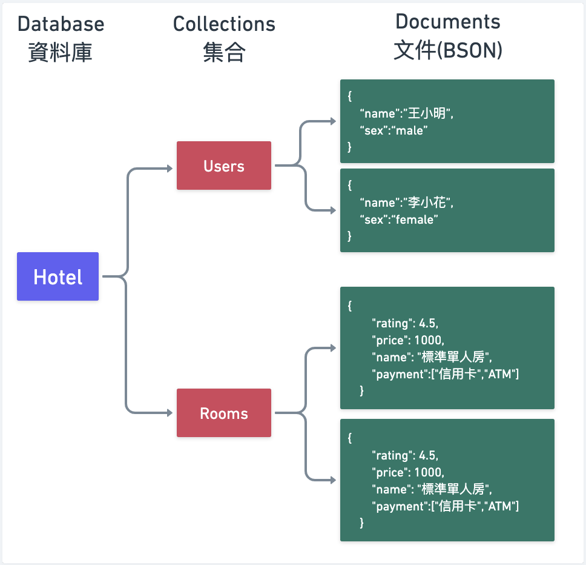
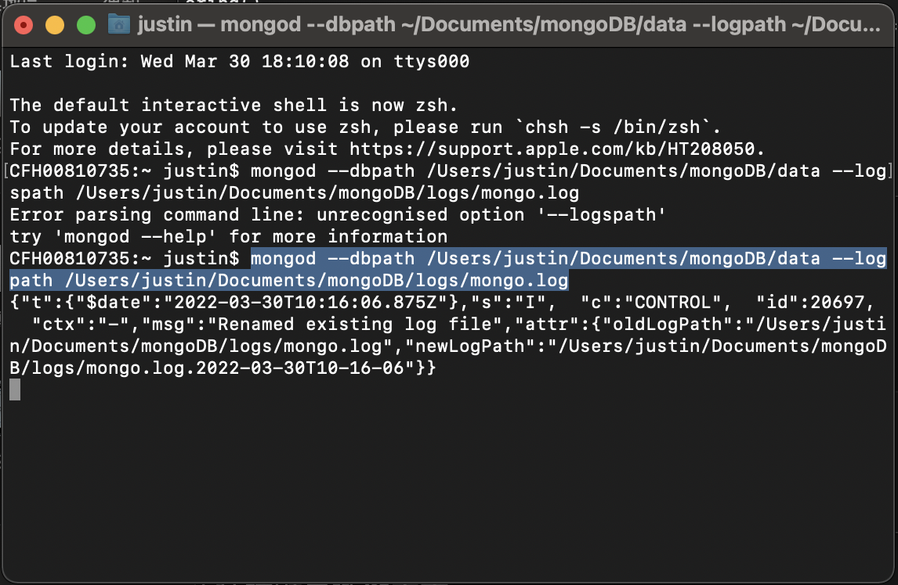
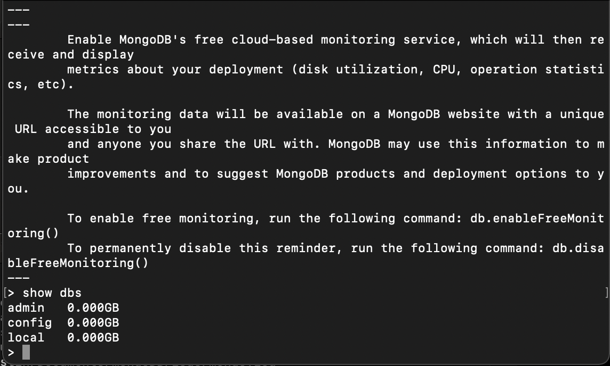
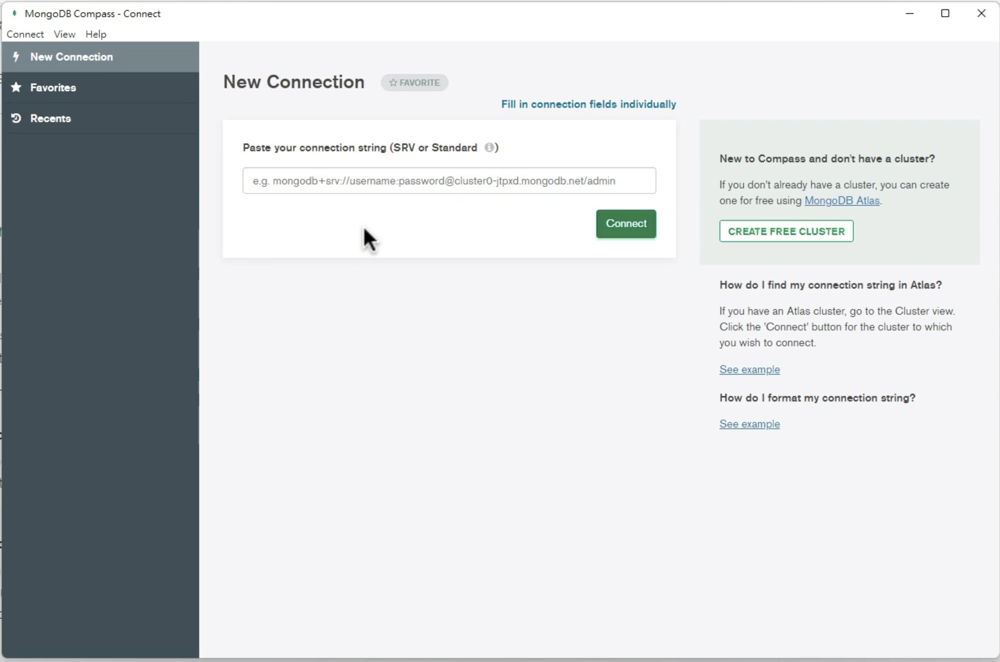
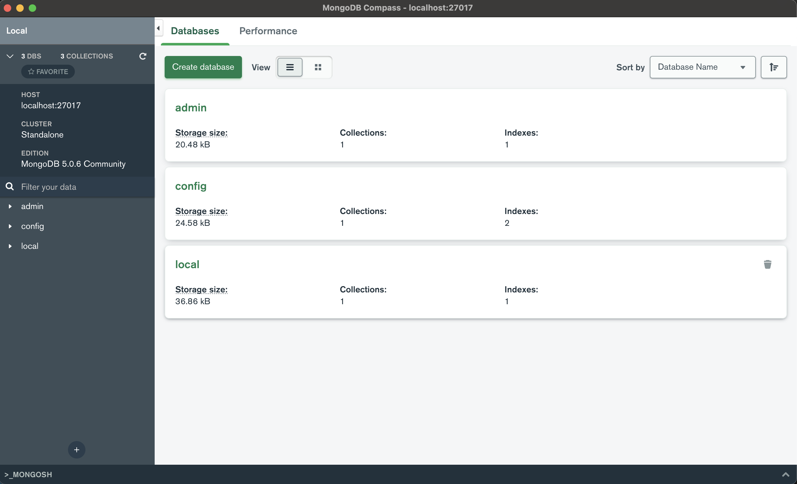

> 這裡記錄了使用MongoDB作為資料庫，與雲端MongoDB Atlas操作記錄，在Jamstack的時代，Mongodb是非常普遍且主流的做法之一。



### 安裝Mongodb for Mac

- 下載社群版本 [https://www.mongodb.com/try/download/community](https://www.mongodb.com/try/download/community)
- 使用管理者權限，將檔案搬移：
- 👉 [官網安裝教學](https://www.mongodb.com/docs/manual/tutorial/install-mongodb-enterprise-on-os-x/)

```jsx
sudo cp /path/to/the/mongodb-directory/bin/* /usr/local/bin/
```

- 在終端機 執行 mongod 與 mongo 這時候會跳警告，要先通過系統審核

- 👉 系統偏好設定 > 安全性與隱私權


### 每次重啟時的指令

- 打開終端機執行，指定db位置與logs位置


```jsx
//可複製以下command
$ mongod --dbpath /Users/justin/Documents/mongoDB/data --logpath /Users/justin/Documents/mongoDB/logs/mongo.log
```
<br/>



- 然後，再開一個終端機，接著就可以開始執行資料庫命令了

```jsx
$ mongo
```

<br/>
- 例如：

```
> show dbs
```

<br/>
- 結果如下：



---

### 使用圖形化介面工具 Compass GUI

- 下載 [https://www.mongodb.com/zh-cn/products/compass](https://www.mongodb.com/zh-cn/products/compass)
- 安裝好後，按下connect



- 看到此畫面代表成功了




---


### MongoDB 相關文章：
- <a href="/blog/mongodb-1/">MongoDB學習筆記 - 安裝啟動與GUI軟體</a><br/>
- <a href="/blog/mongodb-2/">MongoDB學習筆記 - 註冊帳號，並申請MongoDB Atlas雲端主機服務流程</a><br/>
- <a href="/blog/mongodb-3/">MongoDB學習筆記 - MongoDB Shell CRUD語法</a><br/>
- <a href="/blog/mongodb-4">MongoDB學習筆記 - MongoDB Shell - 搜尋語法</a><br/>
