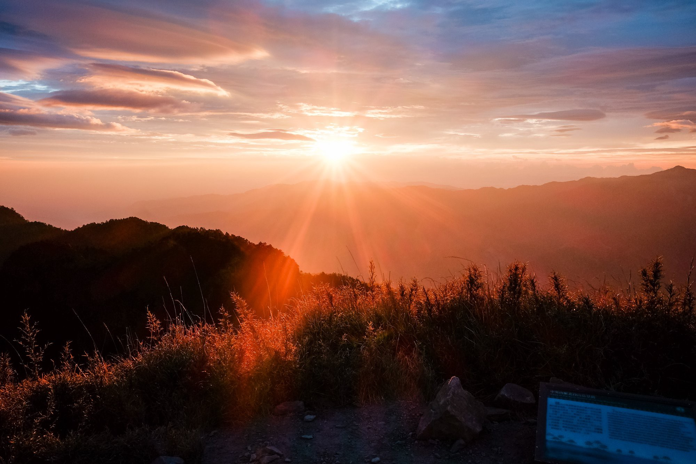
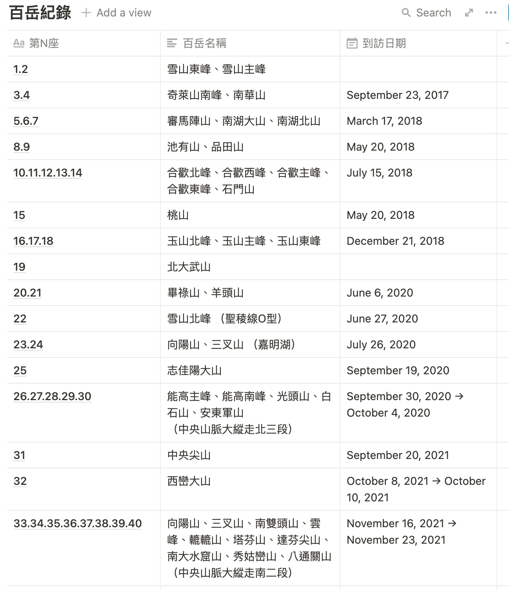
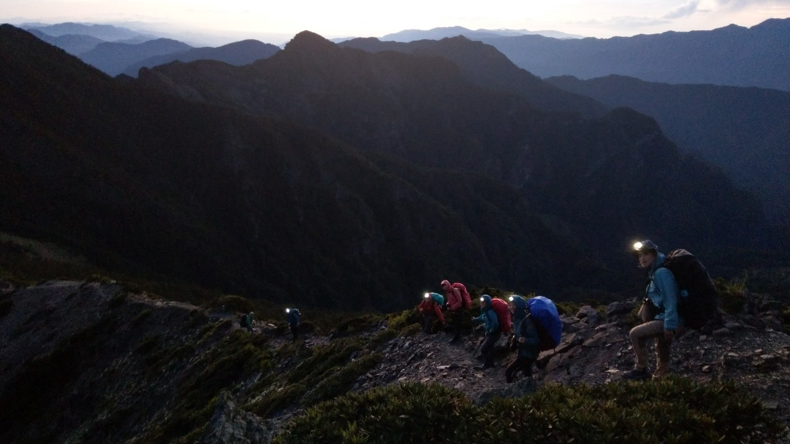
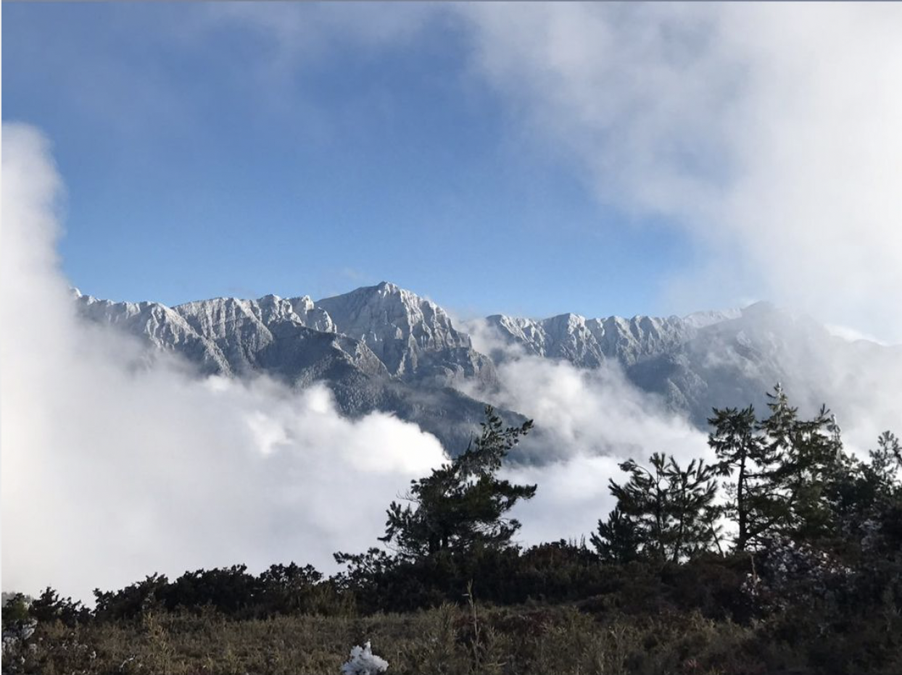
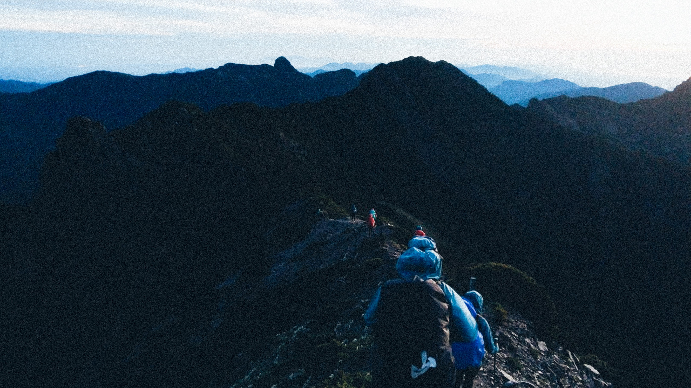

##### 百岳上的日出
 

### 我所爬過的百岳
目前29座，下列表格如果已重複爬的百岳沒有列入
 

##### 百岳紀錄

 
 

<strong>2012</strong>

雪山主東峰，從此與登山結緣。

<strong>2017</strong>

奇萊南華，也是入門百岳，第一次見到日出黃金大草原超興奮的。

<strong>2018</strong>

南湖大山、玉山主北東，當時為了申請爬聖稜線，特別去玉山東峰(C+)登頂拍照。

<strong>2019</strong>

去參加小腳丫登山訓練營，這段日子學習登山安全學習探勘，大部分都爬中級山。

##### 小O型聖稜線相關山岳：雪山東峰、雪山北峰、凱蘭特崑北山、素密達山、布秀蘭山、品田山、品田山前峰、池有山

 
<strong>2020</strong>

這一年很精彩，去了聖稜線O型縱走。

聖稜線是 大霸尖山到雪山 之間整條都是3000公尺以上的山 被稱為聖稜線1928年，日本登山家-沼井鐵太郎首登大霸尖山的隔一年寫下的這句話「神聖的稜線 — 聖稜線」

##### 超美的聖稜線

 

因為當時爬這條稜線很困難，岳界有句話：『走完聖稜， 就可以結婚了！』意思是這麼大的考驗都通過了，將來再大的困難都難不倒。 
然後這一年還去一日單攻天使的眼淚 — 嘉明湖 
能高安東軍大縱走 (中央山脈北三段) 
詳見家暉寫的超有溫度的紀錄：

[【山】走進十月，能高安東軍五日](https://ljhjoyce.medium.com/%E5%B1%B1-%E8%B5%B0%E9%80%B2%E5%8D%81%E6%9C%88-%E8%83%BD%E9%AB%98%E5%AE%89%E6%9D%B1%E8%BB%8D%E4%BA%94%E6%97%A5-7c77b606d1d4)

<strong>2021</strong>

計畫中，先賣個關子

---

##### 在天空破曉的超美聖稜線上

> 每個人都是馴獸師，馴服你內心的那頭猛獸

我現在都跟有默契的隊友一起爬山
體能也差不多 相隔距離大概就是一大步
但在2012
我是參加商業團 我跟隊友不太認識
距離很遙遠，大部分都是自己在獨攀的感覺
你知道隊友就在後面，但也不知道跟前面的距離多遠
也不知道身後的隊友什麼時候才會追上我
所以很長的時間，我只能跟自己對話
對於百岳的初體驗，覺得風景很美，也覺得自己是孤寂的
就像獨自自助旅行一樣
我也蠻喜歡一個人的感覺
時空拉回到現在的爬山
走在這條路上
我會覺得內心是澎湃激昂的

> 沒有為什麼
就是想把這條路給走完

### 山不轉路轉 人不轉就爬吧
為了想爬聖稜線
我們去學習攀岩學架繩
學習過地形
PS: 這張照片不敢給媽媽看

> 森林裡的童話故事小屋，但是沒有王子與公主 
只有一群沒有洗澡的人

### 鐵皮山屋 我們的五星酒店

山屋室內不到10度
伴隨前一晚沒睡好的高反
即便是充氣睡墊也不是那麼好睡
來到雪北山屋，已經是下午了，超累的
在山上睡覺跟休息，沒有那麼舒服
通常都是累了就睡 7.8點就睡， 3.4點就起床
然後是一天新的開始
可以抽到山屋是一件很幸福的事情
沒有背帳篷肩膀少了那一公斤的重量
也省去收帳拆帳的營務

### 我是誰我在哪

週五下班就出發到
山上民宿已十二點
凌晨三四點就起床 根本超康
爬到週日下山回到家
週一繼續上班
我們根本超虐的
睡過鐵皮搭建的民宿以外
我們也睡過部落國小教室外的走廊
超虐

