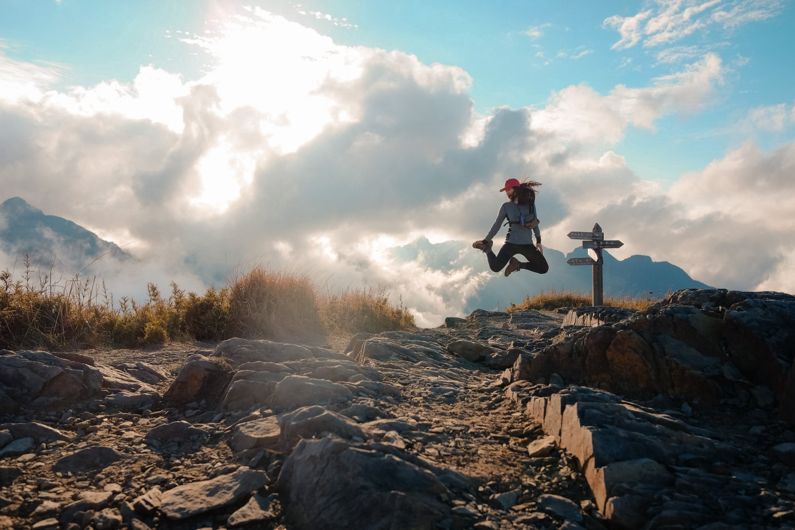

##### 在桃山上跳耀

# 在山裡遊牧

##### 台版的天空之鏡 不用遠到南美洲 就可以感覺到離天空更近的地方

五天四夜 每天都是過著起床收帳拆帳的日子，然後移動到下一個地方

因為連假很多人走，大家不能出國都爬山，都要搶湖邊的營地 （湖景第一排） 所以都要摸早黑。

能高安東軍這一段有無數個高山湖泊

我們在湖邊糜爛煮食看日落

天使的眼淚-嘉明湖去個三天兩夜也才一個湖
我們五天超過五個湖看到飽都超美的

##### 湖邊取水起霧了，多麽美，多麽浪滿

##### 銀河與小鹿 photo by 蘇蘇

## 牠們也沒有這麼可愛…

睡夢半睡半醒

發現帳篷外有點動靜 有腳步聲原來是水鹿大軍⋯

來到他們家撒野沒被叼回去已經是萬幸

第一次被水鹿們盯著上廁所好害羞

約莫40–50隻以上都不怕人

牠們需要攝取鹽分，會來舔人的尿

## 早安 山裡的一天開始了

準備出發 是最開心的時刻
看到日出大景更是興奮

說也奇怪，我在都市的生活都是睡到七晚八晚
但上山的日子，總讓我很有毅力起床 迎接日出
其實在山上睡覺很痛苦，很多時候是被冷醒的

最期待的是晴朗的好天氣，不然濕冷天氣爬山很厭世
這次能安也是前兩天看到天氣突然轉好
才決定出發的

跟夥伴再一起的玉山聖誕趴
我們也不是每次上山都很虐的
也有很多很多糜爛的行程
有空再聊

## 沒有上山的時候就鍛鍊吧

為了維持一定的體能
沒有上山的時候 我們會一起鍛鍊
今年一月的時候報了龍虎鳳越野跑

這是完賽時發的文
因為我們都走在一起
比賽是沒有追求成績

> 只想感受在山林裡漫步的美好
> 但更愛的是
> 因為路上有你們同行
>
> 感謝
>
> 那個一起努力 一起練習
> 永不放棄直到終點的我們

最後：來去山上住一晚吧 露營也可以
