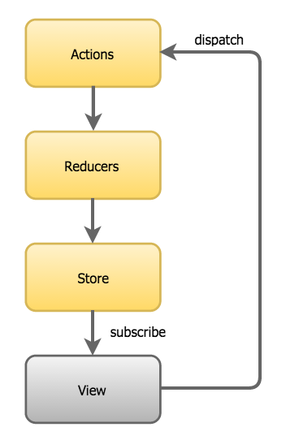

> 每次學習新東西都是寫Todo list實在太無趣了，這是我個人redux學習紀錄：使用react與redux開發一個留言板，並且把相關程式碼放在github上供參考

### Redux data flow



### Actions

Action 在原生 Flux 和 redux 裡，都是一個告知 state 需要改變的物件。通常會長得像這樣：

```
    export const toggleModal = (visible) => {
        return {
            type   : 'TOGGLE_MODAL',
            visible
        };
    };

    /* 透過dipatch 來發送 action */
    dispatch(toggleModal(ture));
```

### Reducers

* Reducer 類似於原生 Flux 的 Store

* Redux 只有一個 Store

* Reducer 接收舊 state 與 action 並回傳一個新的 state

```
    (previousState, action) => newState
```

來看一下modals 的 reducers：

```
    /* 我們給一個state的初始值防止頁面初始值發生錯誤 */
    let initialState = {
        visible: false, /*初始值false, 所以是關閉的*/
    };

    const modals = (state = initialState, action) => {
        switch (action.type) {
            case 'TOGGLE_MODAL':
                return {
                    ...state,
                    visible: action.visible
                };
            default:
                return state;
        };
    };
```

當action.type = ‘TOGGLE_MODAL’時, 回傳新的 state
 其中 visible 被更改為 action.visible 傳進來的值 true
 故modal 被開啟了

*來看一下modals 的 view:

```
    const { visible } = this.props;
    return (
        <div>
            <Modal
                title="請輸入留言訊息"
                visible={visible}
                ...
            </Modal>
        </div>
    )
```

Reducers (Store)的設計：

```
    {
    modals : {
        visible:false,
        message:"", /*輸入時暫存的內容*/
        user:"Justin",
        user_id:"JUSTIN"
    },
    lists: [{
        id:3
        message:""  /*最後儲存的內容*/
        user:"Justin"
        user_id:"JUSTIN"
        time:"2016-3-8 10:50:38"
    }]
    }
```

*Originally published at [github.com](https://github.com/justin3737/redux-message-board/issues/2).*


<br/>
<hr/>
<br/>


### React Redux留言版相關文章：
- <a href="/blog/react-redux-messageboard-0-intro/">學習Redux — Redux留言板實作功能介紹</a><br/>
- <a href="/blog/react-redux-messageboard-1/">學習Redux — 1 右上角按下[留言]的按鈕, 在modal內顯示留言的輸入框(上)</a><br/>
- <a href="/blog/react-redux-messageboard-1-2/">學習Redux — 1 右上角按下[留言]的按鈕, 在modal內顯示留言的輸入框(下)</a><br/>
- <a href="/blog/react-redux-messageboard-2">學習Redux — 2 更新留言訊息</a><br/>
- <a href="/blog/react-redux-messageboard-3/">學習Redux — 3 按下[確認] 新增留言</a><br/>
- <a href="/blog/react-redux-messageboard-4/">學習Redux — 4 留言列表更新</a><br/>
- <a href="/blog/react-redux-messageboard-5/">學習Redux — 5 只有自己可以刪除自己的留言（自己的留言才有[x]按鈕）</a><br/>
- <a href="/blog/react-redux-messageboard-6/">學習Redux — 6 按下[X] 跳出confirm視窗, 詢問是否刪除</a><br/>
- <a href="/blog/react-redux-messageboard-7-practice/">學習Redux — Message-board app 練習題</a><br/>