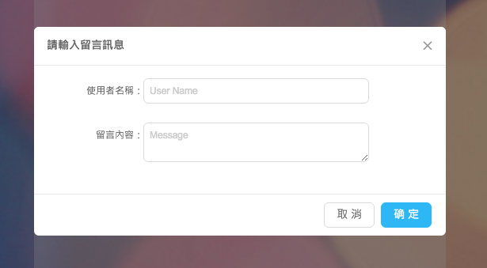

每次學習新東西都是寫Todo list實在太無趣了，這是我個人redux學習紀錄：使用react與redux開發一個留言板，並且把相關程式碼放在github上供參考





## 開啟modal

### * 請先切換到 practice-1 branch

* 開啟 ./src/containers/Header.js

* 把要用的actions import進來:

這邊要用的是 toggleModal 這個action

```
    import { toggleModal, updateMsg } from '../actions';
```

* 在View 上面綁定click 事件

```
    onClick={this._openModal}
```

* 撰寫觸發事件的function
```
    _openModal = () => {
        const { toggleModal } = this.props;
        toggleModal(true);
    }
```

## 練習1 — 關閉modal

* 開啟 ./src/containers/MsgModals.js

* 提示：

* 在 _handleCancel()裡面實作關閉的功能

* 因為留言完畢也需要關閉modal, 故需要在 _handleOk() 裡面實作關閉的功能
```
    _handleCancel = () => {
        const { toggleModal } = this.props;
        dispatch(toggleModal(false));
    }
```

如果使用 bindActionCreator() 可以省略 dispatch

```
    _handleCancel = () => {
        const { toggleModal } = this.props;
        toggleModal(false);
    }
```

## 練習2 — 在留言框中輸入文字並且更新到 store

### * 請先切換到 practice-2 branch


* 開啟 ./src/containers/MsgModals.js

這邊已經把 _onChange() 事件處理好
```
    _onChange = (e) => {
            const { updateUser, updateMsg } = this.props;
            return {
                user : (e) => {
                    /*更新user name輸入欄位*/
                    updateUser(e.target.value);
                },
                message: (e) => {
                    /*更新message輸入欄位*/
                    updateMsg(e.target.value);
                }
            };
        }
```
* 提示：

* 開啟 ./src/reducers/madals.js

* action.type: ‘UPDATE_USER’ 和 ‘UPDATE_MESSAGE’

* 可以參考 ./src/actions/index.js 裡面的 action 來完成 reducers 的實作

```
    const modals = (state = initialState, action) => {
        switch (action.type) {
            case types.TOGGLE_MODAL:
                return {
                    ...state,
                    visible: action.visible
                };
            case types.UPDATE_USER:
                return {
                    ...state,
                    user: action.user
                };;
            case types.UPDATE_MESSAGE:
                return {
                    ...state,
                    message: action.message
                };;
            default:
                return state;
        };
    };
```

## 練習3 — 完成刪除list 的reducer

### * 請先切換到 practice-3 branch

* 提示：

* 開啟 ./src/reducers/lists.js

* action.type: ‘DEL_LIST’

* 可以參考 ./src/actions/index.js 裡面的 action 來完成 reducers 的實作


<br/>
<hr/>
<br/>


### React Redux留言版相關文章：
- <a href="/blog/react-redux-messageboard-0-intro/">學習Redux — Redux留言板實作功能介紹</a><br/>
- <a href="/blog/react-redux-messageboard-1/">學習Redux — 1 右上角按下[留言]的按鈕, 在modal內顯示留言的輸入框(上)</a><br/>
- <a href="/blog/react-redux-messageboard-1-2/">學習Redux — 1 右上角按下[留言]的按鈕, 在modal內顯示留言的輸入框(下)</a><br/>
- <a href="/blog/react-redux-messageboard-2">學習Redux — 2 更新留言訊息</a><br/>
- <a href="/blog/react-redux-messageboard-3/">學習Redux — 3 按下[確認] 新增留言</a><br/>
- <a href="/blog/react-redux-messageboard-4/">學習Redux — 4 留言列表更新</a><br/>
- <a href="/blog/react-redux-messageboard-5/">學習Redux — 5 只有自己可以刪除自己的留言（自己的留言才有[x]按鈕）</a><br/>
- <a href="/blog/react-redux-messageboard-6/">學習Redux — 6 按下[X] 跳出confirm視窗, 詢問是否刪除</a><br/>
- <a href="/blog/react-redux-messageboard-7-practice/">學習Redux — Message-board app 練習題</a><br/>