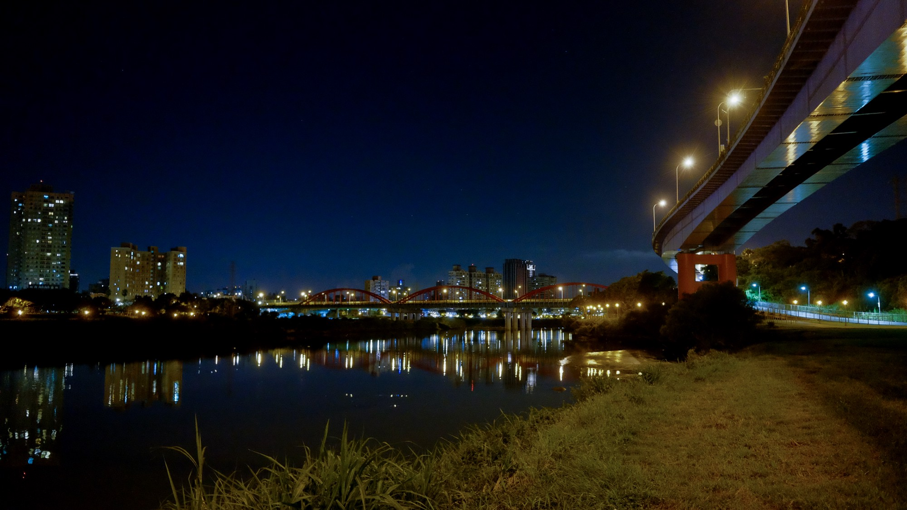

### 前言

趁好天氣本想在平地拍個銀河試試, 沒想到都市光害還真的不是普通嚴重 >_<
用了APP 確認天空中的銀河位置以後, 肉眼還是無法看清楚, 只能說… 想在平地拍銀河真的要盡可能遠離光害越遠越好…

以下六張對焦點在正中央的橋墩上

##### F2.8

##### F4

##### F5.6

##### F8

##### F11

##### F16

### 結論

1. x70 來說大概F8 以後對焦點(後面那座橋)附近的星芒會比較好看一些…

1. F11 ~ F16 左右感覺會是比較漂亮海膽刺星芒, 我個人最喜歡F16 的星芒

1. 富士的鏡頭星芒真的只能算尚可接受, 真的要拍星芒 上福倫達 或是轉接N家的鏡頭會有更驚豔的表現。

##### 現場情境圖
